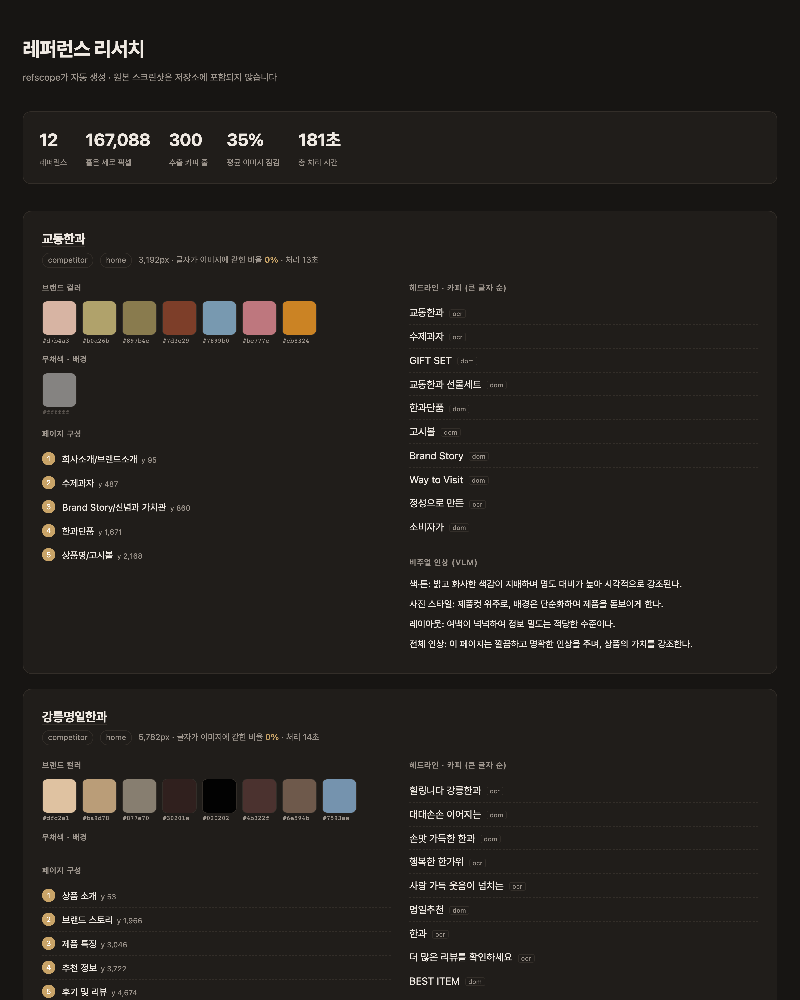
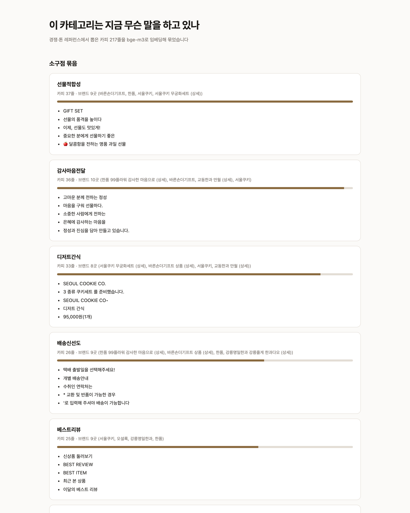

# refscope — 레퍼런스 리서치 자동 정리기

> 브랜드 디자이너가 경쟁사 상세페이지를 손으로 옮겨 적던 일을, URL 목록 하나로 끝낸다.
> **Main Quest 2** · 박정목 (브랜드·상품 디자이너)

한국 커머스 상세페이지는 **세로 영역의 81%가 이미지에 구워진 글자**다. 복사도 검색도 안 되니
디자이너가 화면을 보며 타이핑한다. refscope는 그 전사(轉寫) 노동을 대신하고, 판단만 남긴다.

**사람 43분 (3개) → refscope 약 4분 (12개).** 전 단계 로컬 실행, API 비용 0원.



---

## 무엇이 나오나

**1. 브랜드별 리서치 카드** — 컬러 팔레트 · 헤드라인 카피 · 페이지 구성 · 비주얼 인상

**2. 카테고리 메시지 패턴** — "이 바닥은 무슨 말을 하고 있고, 내가 안 하는 말은 무엇인가"



경쟁 11곳의 카피 217줄을 묶어보니 단정(내 브랜드)은 **"국내산 재료"를 아무도 말하지 않는
자리로 비워두고 있었다.** 경쟁 5곳이 원산지를 말하는데 프리미엄을 표방하는 내가 안 하고 있다.
이게 카드 12장이 아니라 이 도구의 진짜 산출물이다.

---

## 실행 방법

### 1. 필요한 것

- **macOS (Apple Silicon 권장)** — 기본 OCR이 macOS 내장 Vision이다.
  다른 OS에서는 `--engine paddleocr`로 대체할 수 있다 (아래 참고).
- Python 3.12+, [uv](https://docs.astral.sh/uv/), [Ollama](https://ollama.com)
- 디스크 약 8GB (Ollama 모델)

### 2. 설치

```bash
git clone <이 저장소> && cd Main-Quest-2
uv sync --extra ocr
uv run playwright install chromium
```

```bash
brew install ollama && ollama serve
```

```bash
ollama pull qwen2.5vl:7b && ollama pull bge-m3
```

### 3. 한 번에 돌리기

```bash
uv run refscope run --only danjeong
```

수집 → 판정 → 조각내기 → 글자 추출 → 카드 생성까지 이어진다.
결과는 `out/research.html`에 열린다. (`danjeong`은 작성자 소유 사이트라 안전한 시연 대상이다)

전체 평가셋 12개를 돌리려면 `--only`를 빼면 된다.

### 4. 단계별로 돌리기

```bash
uv run refscope collect
```
레퍼런스 페이지를 캡처하고 DOM을 추출한다. `robots.txt`를 확인하고 요청 사이에 2초를 둔다.

```bash
uv run refscope analyze
```
구간마다 "글자가 있나 / 큰 그림이 있나"를 판정한다. **재수집 없이 몇 번이든 다시 돌릴 수 있다.**

```bash
uv run refscope crop && uv run refscope read
```
OCR 대상 구간을 잘라내고 글자를 꺼낸다.

```bash
uv run refscope build
```
컬러·구조·톤을 붙여 리서치 카드 HTML을 만든다.

```bash
uv run python -m refscope.patterns
```
카테고리 공통 소구점과 내가 비워둔 자리를 찾는다. → `out/patterns.html`

### 5. 실험 재현

```bash
uv run refscope compare --engines apple_vision paddleocr easyocr qwen2.5vl
```
OCR 엔진 4종을 같은 조각에 돌려 채점한다.

```bash
uv run python -m refscope.compare_abc
```
비교군 A(수작업) / B(순진한 AI) / C(refscope)를 같은 자로 잰다.

```bash
uv run python -m refscope.score_sections
```
섹션 분류 정확도를 bge-m3 유사도로 채점한다.

---

## 파이프라인

```
[data/refs.yaml : URL 목록]
        │
        ▼
  ① 수집 (Playwright)  ──▶ 풀페이지 PNG + DOM 텍스트 + 계산된 스타일
        │
  ② 읽기 경로 판정 ← 모델이 아니라 검사. 여기가 이 PoC의 심장
        │   세로 구간마다: 글자가 있나 / 큰 그림이 있나
        ├─ dom   : 브라우저가 가진 무손실 원본을 그대로 쓴다 (OCR 안 돌림)
        ├─ ocr   : 통이미지 구간 → ③
        └─ both  : 히어로 배너처럼 둘 다
        │
  ③ 글자 추출 (Apple Vision) ──▶ 글자 + 위치 + 크기
        │
  ④ 컬러 (k-means + 무채색 분리)      ⑤ 구조·톤
        │                                ├─ 나누기: y 간격 (결정적)
        │                                ├─ 이름:   Qwen2.5-VL (텍스트)
        │                                └─ 톤:     Qwen2.5-VL (대조 시트)
        ▼
  [out/research.html]  브랜드별 리서치 카드
        │
  ⑥ 패턴 (bge-m3 임베딩 + k-means)
        ▼
  [out/patterns.html]  카테고리 소구점 + 내가 비워둔 자리
```

**설계 원칙 하나**: 일을 쪼개서 각자 잘하는 것만 시킨다.
큰 글자 고르기는 규칙, 구간 나누기는 좌표, 이름 짓기는 LLM, 색은 픽셀, 눈이 필요한 것만 VLM.

---

## 성능

상세페이지 3개 기준, 사람이 손으로 한 것과 나란히.

| 비교군 | 소요 | 카피 | 재현율 | 근거율 | 컬러 |
|---|---|---|---|---|---|
| A 수작업 | 2,580s (43분) | 13줄 | 100%* | 100% | 9/9 |
| B 순진한 AI (VLM에 통째로) | 75s | 20줄 | 38% | **61%** | **3/9** |
| **C refscope** | **58~78s** | **75줄** | **84%** | **100%** | **6/9** |

**B와 C는 같은 모델로 거의 같은 시간을 쓴다.** 다른 것은 설계뿐이다.
B가 뱉은 카피의 **39%는 페이지에 없는 문장**이고, 컬러는 CSS 상투색을 추측했다.

### OCR 엔진 비교

| 엔진 | 재현율 | 추출 글자 | 교차확인 | 소요 |
|---|---|---|---|---|
| **apple_vision** | 100% | 10,106자 | **86%** | **14s** |
| easyocr | 100% | 13,402자 | 59% | 110s |
| qwen2.5vl | 100% | 13,260자 | 85% | 1,301s |
| paddleocr | 92% | 5,607자 | 91% | 163s |

**VLM을 OCR로 쓰면 안 된다** — 93배 느린데 정확도 이득이 없다.
글자 수가 많다고 잘 읽은 것도 아니다 — EasyOCR은 절반 가까이가 헛것이다.

자세한 근거: [모델 선정 문서](docs/02_model_selection.md) · [검증 결과](docs/03_verification.md)

---

## 다른 OS에서 쓰려면

Apple Vision은 macOS 전용이다. 엔진은 인터페이스가 통일돼 있어 갈아 끼울 수 있다.

```bash
uv run refscope read --engine paddleocr --force
```

PaddleOCR은 재현율이 92%로 조금 낮고 12배 느리지만, 교차확인 91%로 가장 보수적이다
(확신하는 것만 내놓는다).

---

## 저작권 · 수집 원칙

리서치는 남의 결과물을 보는 일이라 규칙을 먼저 정하고 시작했다.

1. **원본 스크린샷은 저장소에 올리지 않는다.** `.gitignore`로 막는다.
2. 저장소에는 **URL 목록 + 수집 스크립트 + 파생 데이터**(추출 텍스트, 컬러 값, 통계)만 둔다.
   남이 실행하면 같은 결과가 재현되면서 타사 이미지는 재배포되지 않는다.
3. 공개 페이지만 대상으로 하고, `robots.txt`를 존중하며, 요청 사이에 2초를 둔다.
   페이지의 어떤 것도 클릭하지 않는다 — 팝업은 CSS로 가리기만 한다.
4. 문서에 싣는 시연 이미지는 **작성자 소유 자산(단정)** 이거나 자동 생성 결과물뿐이다.

---

## 한계

이 도구는 **자신 있게 틀릴 수 있다.** 알고 있는 것부터 적는다.

- **섹션 분류 47%** (목표 70% 미달). 연출샷처럼 글자 없는 구간은 텍스트로 못 나눈다.
- **모듈끼리 서로 검증하지 않는다.** 실제로 팔레트가 거의 검정인 페이지를 VLM은
  "따뜻한 베이지"라고 서술했는데 아무도 이의를 제기하지 않았다.
- **평가셋 12개, 정답 3개 사이트.** 현재 결론은 "이 3개에서 그랬다" 이상이 아니다.
- 무한 스크롤 사이트에서 수집이 늘어진다 (한품 99.6초 vs 보통 4~22초).

겪은 실패 8건의 전체 목록과 원인은 [검증 문서 3절](docs/03_verification.md#3-실패-사례)에 있다.

---

## 문서

| | |
|---|---|
| [문제 정의서](docs/01_problem_definition.md) | 도메인 · 현재 문제 · 개선 가설 · 대상 사용자 · 성공 기준 |
| [모델 선정 & 근거](docs/02_model_selection.md) | 네 갈래의 후보 비교와 선택 이유 |
| [개선 효과 검증](docs/03_verification.md) | A/B/C 비교 · 실패 사례 8건 · 한계와 다음 스텝 |
| [베이스라인 원본](data/baseline/) | PoC를 보기 전에 손으로 측정한 기록 |

## 구조

```
src/refscope/
  capture.py        수집 (Playwright). robots.txt·오류 페이지 방어
  regions.py        읽기 경로 판정 — 구간 단위, 세로 피복
  crops.py          OCR 대상 구간 잘라내기
  ocr.py            엔진 4종 공통 인터페이스
  ocr_worker.py     엔진별 격리 실행 (서로 망가뜨린다)
  palette.py        k-means + CIEDE2000
  synthesize.py     카피 고르기 · 구간 나누기 · 이름 · 톤
  render.py         리서치 카드 HTML
  patterns.py       카테고리 소구점 + 빈자리
  embed.py          bge-m3 (캐시 포함)
  compare_ocr.py / report_ocr.py / compare_abc.py / score_sections.py   실험·채점
```
